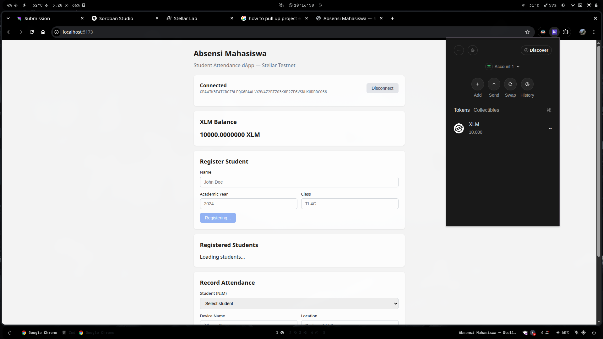
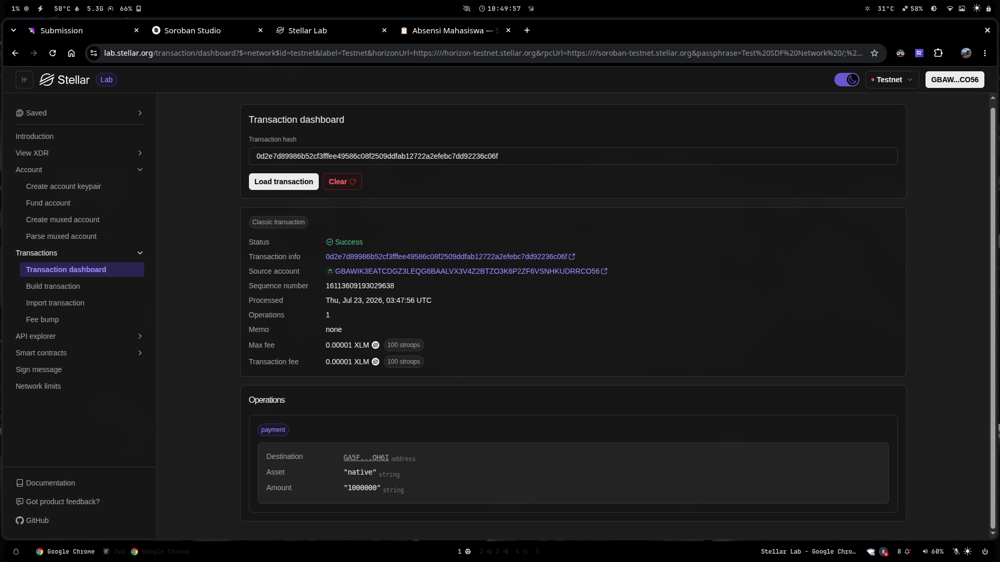
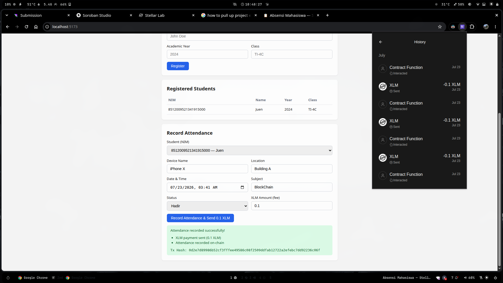

# Absensi Mahasiswa — Soroban Smart Contract + React dApp

A decentralized student attendance management system built on the **Stellar blockchain** using **Soroban smart contracts** (Rust), with a **React + Vite** frontend dApp that connects via **Freighter Wallet**.

Register students and record attendance immutably on-chain — each attendance requires a configurable XLM transfer to the deployer address as a verification fee.

---

## Smart Contract

### Features

| Function | Description |
|---|---|
| `get_mahasiswa` | Retrieve all registered students |
| `create_mahasiswa` | Register a new student (name, year, class) |
| `delete_mahasiswa` | Remove a student by NIM |
| `get_absensi` | Retrieve all attendance records |
| `create_absensi` | Record attendance linked to a student (NIM, device, location, datetime, subject, status) |

### Data Structures

```rust
pub struct Mahasiswa {
    pub nim: u64,       // auto-generated
    pub nama: String,
    pub tahun: String,  // e.g. "2024"
    pub kelas: String,  // e.g. "IF-A"
}

pub struct Absensi {
    pub id: u64,
    pub mahasiswa: Mahasiswa,
    pub device_name: String,
    pub location: String,
    pub datetime: String,
    pub subject: String,
    pub status: String,  // "Hadir", "Izin", "Sakit", "Alpa"
}
```

### Testnet Deployment

| Property | Value |
|---|---|
| **Network** | Stellar Testnet |
| **Contract ID** | `CBAMBILE2GHTSOMB7LX3YMBR2ZVW2G76QNZK375QFAICVGTUGAWDGCFW` |
| **Deployer Address** | `GA5FHXZRASYTNPWAT3MJKX232ZG7NSQKQHVJQUX6V7SPWBPDUM2PQH6I` |
| **RPC URL** | `https://soroban-testnet.stellar.org` |
| **Explorer** | [Stellar Lab](https://lab.stellar.org/contract-explorer) |

### Build & Test (Rust)

```bash
cargo build --target wasm32-unknown-unknown --release
cargo test
```

### Deploy

```bash
stellar contract deploy \
  --wasm target/wasm32-unknown-unknown/release/notes.wasm \
  --network testnet \
  --source <YOUR_SECRET_KEY>
```

### Invoke via CLI

**Register a student:**
```bash
stellar contract invoke \
  --id CBAMBILE2GHTSOMB7LX3YMBR2ZVW2G76QNZK375QFAICVGTUGAWDGCFW \
  --network testnet \
  --source <YOUR_SECRET_KEY> \
  -- create_mahasiswa \
  --nama "John Doe" \
  --tahun "2024" \
  --kelas "TI-4C"
```

**Get all students:**
```bash
stellar contract invoke \
  --id CBAMBILE2GHTSOMB7LX3YMBR2ZVW2G76QNZK375QFAICVGTUGAWDGCFW \
  --network testnet \
  --source <YOUR_SECRET_KEY> \
  -- get_mahasiswa
```

**Record attendance:**
```bash
stellar contract invoke \
  --id CBAMBILE2GHTSOMB7LX3YMBR2ZVW2G76QNZK375QFAICVGTUGAWDGCFW \
  --network testnet \
  --source <YOUR_SECRET_KEY> \
  -- create_absensi \
  --nim 1 \
  --device_name "iPhone 15" \
  --location "Gedung A Lt.3" \
  --datetime "2025-01-20 08:00" \
  --subject "Basis Data" \
  --status "Hadir"
```

---

## Frontend dApp

A browser-based dApp that connects to Freighter wallet, displays XLM balance, and interacts with the attendance contract on Stellar Testnet. Built with **React 18**, **Vite**, **TypeScript**, **@stellar/stellar-sdk v12**, and **@stellar/freighter-api v3**.

### Screenshots

#### Wallet Connected & Balance Displayed


#### Successful Testnet Transaction


#### Transaction Result Shown to User


### Prerequisites

- [Freighter Wallet](https://freighter.app/) browser extension (install, create account, switch to Testnet)
- Node.js 18+

### Setup

```bash
cd frontend
npm install
```

### Run

```bash
cd frontend
npm run dev
```

Open `http://localhost:5173` in your browser.

### Usage

1. Install **Freighter Wallet** and fund your wallet from the [Stellar Testnet Friendbot](https://laboratory.stellar.org/#account-creator?network=testnet)
2. Open the app and click **Connect Freighter Wallet**
3. Your wallet address and **XLM balance** appear on screen
4. Register a student (name, year, class)
5. Record attendance — fills all fields including a configurable **XLM amount** (default 0.1 XLM). Submitting sends XLM to the deployer address, then records attendance on-chain
6. **Transaction feedback** shows success/failure with the transaction hash

### Features

| Feature | Description |
|---|---|
| **Wallet Connect** | Freighter wallet integration via `requestAccess()` |
| **XLM Balance** | Real-time balance from Horizon |
| **Student Registration** | Register new students on-chain |
| **Attendance Recording** | Record attendance + XLM payment to deployer |
| **Transaction Feedback** | Success/failure with tx hash and step-by-step log |

### Project Structure

```
.
├── contracts/
│   └── notes/              # Soroban smart contract (Rust)
├── frontend/
│   └── src/
│       ├── components/
│       │   ├── WalletConnector.tsx
│       │   ├── BalanceDisplay.tsx
│       │   ├── StudentForm.tsx
│       │   ├── StudentList.tsx
│       │   ├── AttendanceForm.tsx
│       │   └── TransactionFeedback.tsx
│       ├── hooks/
│       │   ├── useWallet.ts
│       │   └── useContract.ts
│       ├── config.ts
│       ├── App.tsx
│       ├── App.css
│       └── main.tsx
├── balance.png
├── succesfull-transaction.png
├── testnettransaction.png
└── README.md
```

---

## License

MIT
